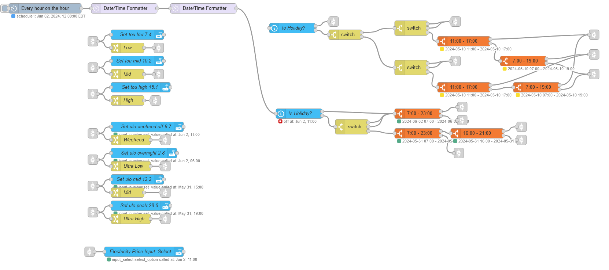

# Temaple Name

Update electricity pricing and store it in an `input_select` and `input_number` in HA. The input number entity allows me to use HA energy tab and calculates cost while the input select allows me to more easily make automations around the pricing. The seperation allows for easier modification if we switch between different plans with the electricity provider.

This flow contains two pricing models that my local electricity provider offers.

## Flow

## Requirements

### Node-Red packages

        "node-red-contrib-home-assistant"
        "node-red-contrib-time-range-switch"

### Home Assistant

- A holiday tracking entity in HA. I am using [Holiday](https://www.home-assistant.io/integrations/holiday)
