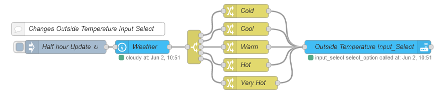

# Temaple Name

Every 30min get the temperature then categorize it into one of five options, then store it into a HA `input_select`. 

This makes it easier to manage other flows and automations based on ouside tempaerature ranges. 

## Flow

## Requirements

### Node-Red packages

        "node-red-contrib-home-assistant"

### Home Assistant

- A weather tracking entity in HA. I am using [Meteorologisk institutt (Met.no)](https://www.home-assistant.io/integrations/met/)
  