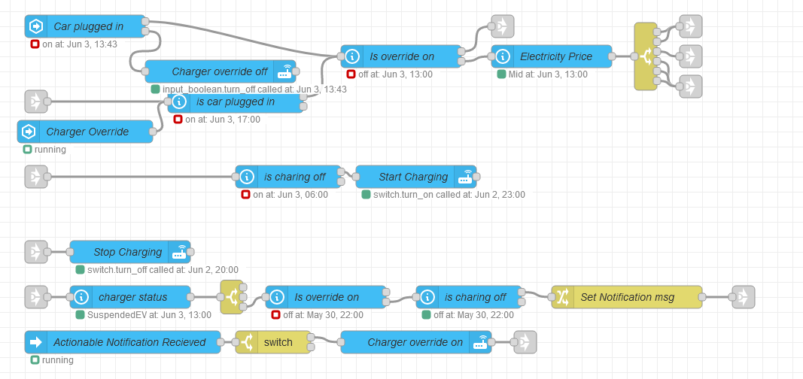

# Temaple Name

Set my car OCPP compatible car charger to charge when a car is pluged in but only during lower cost energy prices.Sends a notification to allow for overrides if the electricity pricing is high. 

## Flow

## Requirements

### Node-Red packages
The full list of packages that are required:

        "node-red-contrib-home-assistant"

### Home Assistant
- [Home Assistant Community Store](https://hacs.xyz/) (HACS)
  - [Open Charge Point Protocol (OCPP)](https://github.com/lbbrhzn/ocpp) installed through HACS

### Other Node-Red flows
- [Send Notifications](./../../Notifications/Send%20Notification/)
- [Electricity Pricing](./../../Core/Electricity%20Pricing/)
