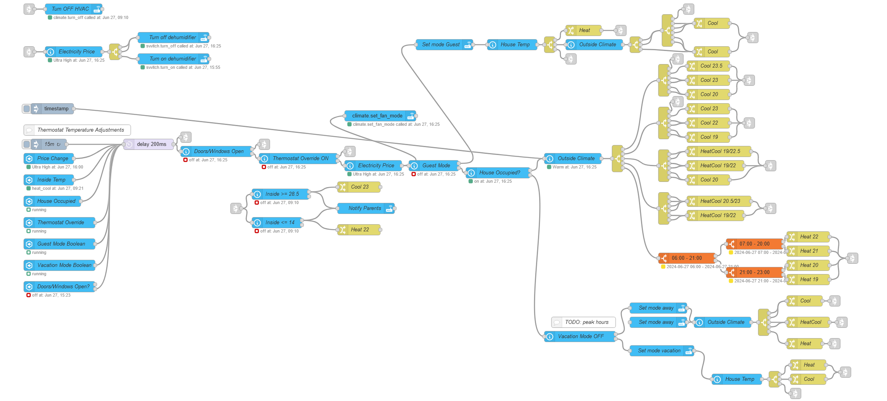

# Climate Control

This flow control the temperature and mode of your thermostate. 

## Flow




## Requirements

### Node-Red packages

        "node-red-contrib-home-assistant"
        "node-red-contrib-time-range-switch"

### Home Assistant

- Helpers in home assistant
  - Thermostate Override toggle
  - Vacation Mode toggle
  - Guest Mode toggle
  - Doors and Windows Group
    - This group will allow you to see if any doors and windows are open without needing to check each one individually

- Occupancy sensor
I used a yaml file to create this one. In the configuration.yaml add the following
````yaml
binary_sensor: !include_dir_merge_list binary_sensors/
````

then create a folder `binary_sensors` and then another yaml inside that folder with whatever name you want and place the following in that file.

````yaml
- platform: template
  sensors:
    someone_home:
      friendly_name: Someone Home
      icon_template: >-
        
          mdi:home-account
        
          mdi:home-outline
        
      value_template: "{{ is_state('person.someperson','home') or is_state('person.anotherperson','home') }}"

````

### Other Node-Red flows

- [Outside Temp](./../../Core/Outside%20Temp/)
- [Electricity Price Temp](./../../Core/Electricity%20Price/)
